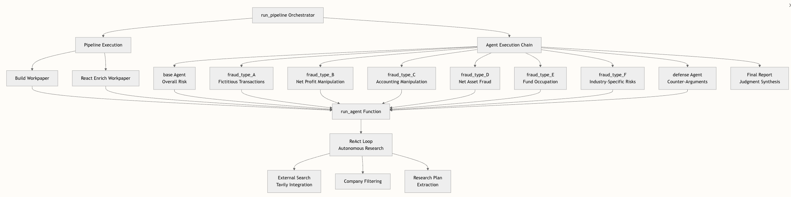

# ForenSight（证镜）财务分析与风险研判系统

ForenSight 是一个面向财报文本的多智能体（Multi-Agent）分析原型，用于输出**结构化舞弊风险研判结果**。系统会从文档中抽取财务信息、构建工作底稿，交由多个专题智能体并行分析，最后由裁决智能体汇总为最终风险结论。

## 核心能力

- 多智能体协同分析：`base + fraud_type_A~F + defense(可选)`
- 结构化输出：`workpaper.json`、各智能体报告、`final_report.json`
- 异步流式可视化：Web 端按阶段展示推理进度和步骤输出
- 财报文件上传：支持 `.odf` / `.odt` / `.pdf`
- 可选外部检索：配置 Tavily 后支持自主补充证据（ReAct 风格重试）

## 系统流程


系统架构展示：



## 技术栈

- 后端：FastAPI + Uvicorn
- 模型调用：DeepSeek Chat Completions（OpenAI-compatible）
- 文档解析：`pypdf` + ODF(XML) 提取
- 前端：Jinja2 模板 + 原生 JS/CSS
- 测试：Pytest

## 项目结构

```text
src/
  web_app.py         # FastAPI 应用与异步运行管理
  orchestrator.py    # 主流程编排（摘要/财务抽取/工作底稿/agent/最终裁决）
  agents.py          # 各风险智能体与并发执行
  workpaper.py       # 工作底稿构建与补全
  financials.py      # 财务字段抽取、回退策略、比率计算
  llm_client.py      # LLM 调用封装（当前 deepseek）
  tavily_client.py   # 可选联网检索
  pdf_loader.py      # PDF 分块与关键文本抽取
  summarizer.py      # 文本摘要
  run_logger.py      # 运行日志

templates/           # Web 页面模板
static/              # 前端脚本与样式
outputs/             # 每次运行产物（git 忽略）
tests/               # 测试用例
```

## 快速开始

### 1) 环境要求

- Python >= 3.9

### 2) 安装依赖

```bash
python3 -m venv .venv
source .venv/bin/activate
pip install --upgrade pip
pip install -r requirements.txt
```

或使用 Makefile：

```bash
make setup
```

### 3) 配置环境变量

```bash
cp .env.example .env
```

至少需要配置：

- `LLM_API_KEY=your_deepseek_api_key`

可选配置：

| 变量 | 说明 | 默认值 |
|---|---|---|
| `LLM_PROVIDER` | 当前固定 deepseek | `deepseek` |
| `LLM_MODEL_NAME` | 模型名 | `deepseek-chat` |
| `LLM_BASE_URL` | API 基础地址 | `https://api.deepseek.com` |
| `LLM_TIMEOUT_SECONDS` | 请求超时秒数 | `90` |
| `LLM_MAX_RETRIES` | LLM 重试次数 | `2` |
| `AGENT_MAX_CONCURRENCY` | 智能体并发数（代码会限制在 1~16） | `4` |
| `TAVILY_API_KEY` | 外部检索 API（可选） | 空 |
| `DEBUG` | 调试开关 | `false` |

### 4) 启动服务

```bash
make run-web
```

等价命令：

```bash
uvicorn src.web_app:app --reload
```

打开浏览器访问：`http://127.0.0.1:8000`

## 使用方式

### Web 端

1. 在侧栏确认模型与 Base URL（Provider 固定为 DeepSeek）。
2. 上传财报文件（`.odf/.odt/.pdf`）。
3. 点击“运行分析”，查看流程画布、各智能体输出和最终报告。

提示：若未配置 `LLM_API_KEY`，前端会禁用运行按钮。

### API

#### 1) 上传财报

```bash
curl -X POST "http://127.0.0.1:8000/api/upload-report" \
  -F "file=@/absolute/path/to/report.pdf"
```

成功后返回 `report_id`。

#### 2) 同步运行（直接返回完整结果）

```bash
curl -X POST "http://127.0.0.1:8000/api/run?mode=sync" \
  -H "Content-Type: application/json" \
  -d '{
    "uploaded_report_id": "<report_id>",
    "enable_defense": true,
    "model": "deepseek-chat",
    "base_url": "https://api.deepseek.com"
  }'
```

#### 3) 异步运行（轮询状态）

```bash
curl -X POST "http://127.0.0.1:8000/api/run?mode=async" \
  -H "Content-Type: application/json" \
  -d '{
    "input_texts": ["示例财务文本..."],
    "enable_defense": true
  }'
```

返回 `run_id` 后查询：

```bash
curl "http://127.0.0.1:8000/api/status?run_id=<run_id>"
```

## 前端界面示例

前端展示截图：


## 输出说明

每次运行会生成独立目录：`outputs/run_<timestamp_ns>_<id>/`

- `run.log`：步骤级日志（JSONL）
- `workpaper.json`：结构化工作底稿
- `agent_reports/*.json`：各智能体输出
- `final_report.json`：最终综合结论

`final_report.json` 关键字段：

- `overall_risk_level`
- `accepted_points`
- `rejected_points`
- `rationale`
- `uncertainty`
- `suggestions`

## 测试

运行全部测试：

```bash
make test
```

或：

```bash
python -m pytest
```

## 开源与协作

- 许可证：`MIT`（见 `LICENSE`）
- 安全策略：见 `SECURITY.md`
- 贡献指南：见 `CONTRIBUTING.md`
- 致谢说明：见 `ACKNOWLEDGEMENTS.md`

## 致谢与灵感来源

感谢深圳证券交易所财务舞弊监管 AI 大模型课题组发布论文《AI大模型驱动的智能博弈财务舞弊识别系统构建》，其公开的研究思路与架构对本项目有重要启发。

说明：

- 该论文未公开源码。
- 本仓库为基于公开论文思想与架构的独立学习型实现（复刻），代码由本项目自行实现并开源。
- 如需引用论文文字、图表或大段内容，请遵循原论文的版权与引用规范。

## 常见问题

- 报错 `Missing API key`：请在 `.env` 配置 `LLM_API_KEY`。
- 报错 `No input texts or uploaded report`：`/api/run` 必须提供 `input_texts` 或 `uploaded_report_id`。
- 报错“当前仅支持 DeepSeek 模型”：后端目前只允许 `deepseek*` 模型名。
- 未配置 Tavily：系统仍可运行，但自主外部调查会被跳过。

## 说明

本项目为研究/原型用途，输出结果仅用于辅助分析，不构成审计或投资建议。
